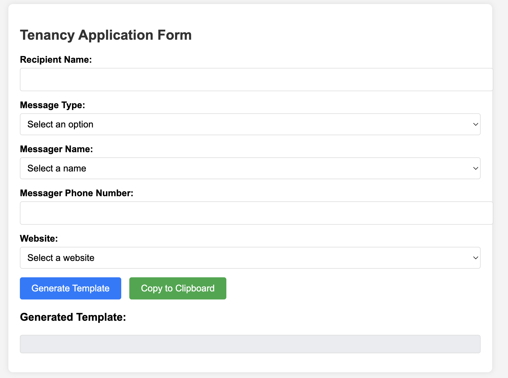
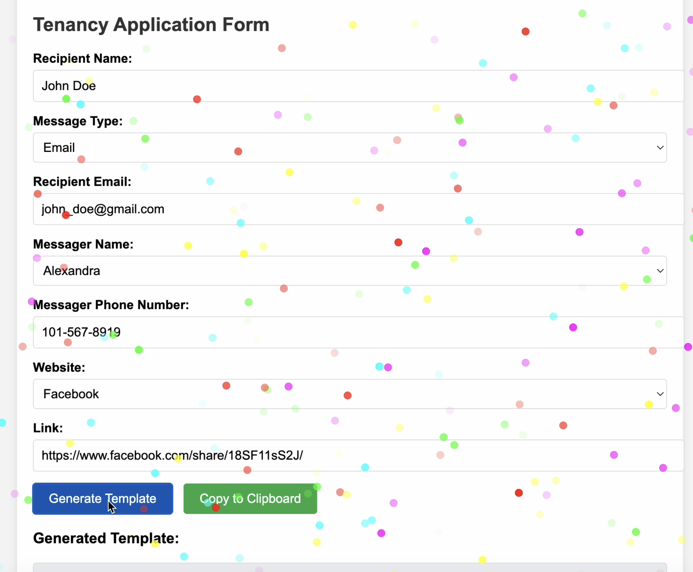
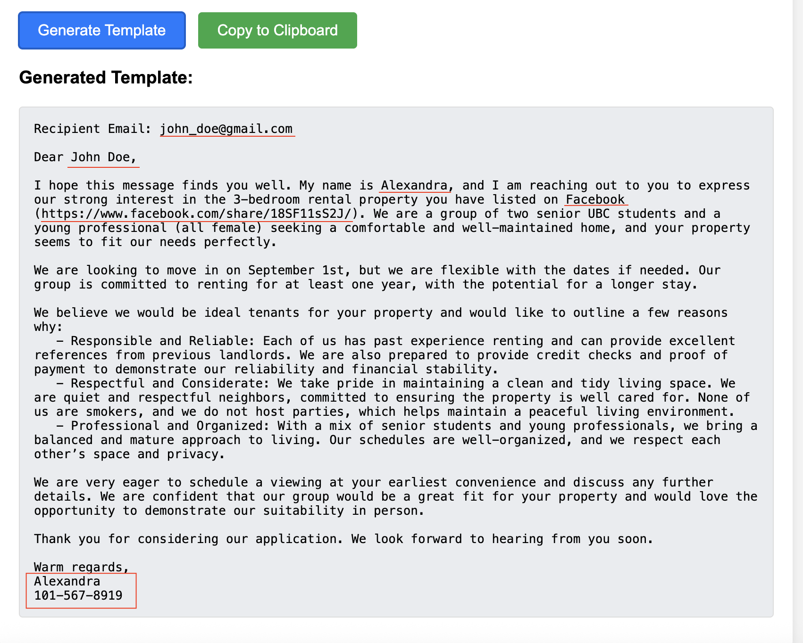

# Housing Inquiry Generator

## Live Demo 

https://zhisniacova.github.io/housing-inquiry-generator/

## Preview 

### Main Interface


### Successful Message Generation


### Generated Inquiry Message


Additional screenshots showing dropdown logic, validation errors, and UI states are available in the `/screenshots` folder.


A lightweight web tool that generates personalized inquiry messages for rental listings.

This tool was built to streamline outreach to landlords when searching for housing. Instead of manually writing dozens of similar messages, the application generates a formatted message template based on the listing platform, contact method, and sender information.

The generated message can then be copied to the user's clipboard and sent via SMS, email, or website contact forms.


## Features

- Dynamic form for entering listing and contact information
- Generates personalized inquiry messages automatically
- Supports multiple contact types:
  - SMS
  - Email
  - Website contact forms
- Conditional form fields based on message type
- Automatic phone autofill based on selected sender
- Input validation for phone numbers and required fields
- Copy-to-clipboard functionality
- Visual confirmation using a confetti animation


## Technologies Used

- HTML
- CSS
- JavaScript


## How to Run

1. Download or clone this repository
```text
git clone https://github.com/YOUR_USERNAME/housing-inquiry-generator.git
```


2. Open the file
```text
index.html
```
in any web browser.

No installation or server is required


## Example Use Case

When searching for housing, it's common to send many similar messages to different landlords across platforms like Craigslist, Facebook Marketplace, and rental websites.

This tool helps automate that process by generating a ready-to-send message template using the information provided in the form.


## Project Structure
```text
housing-inquiry-generator
│
├── index.html # Main web application
└── README.md # Project documentation
```


## Future Improvements

Possible improvements to this tool could include:

- Separating JavaScript into its own file
- Separating CSS into a stylesheet
- Adding customizable message templates
- Supporting multiple saved sender profiles
- Deploying the tool with GitHub Pages


## Author

Alexandra Chistyakov Klochko